# Struts2、Spring与Hibernate整合应用：基于SSH框架的学生成绩管理系统

>   最近一个实验课程，需要做一个基于`SSH框架`的`学生成绩管理系统`。就简简单单做了一下……

## 1. 要求原文

>   其实这个要求文档，网上有......

### 1.1 实验要求：

（1） 整合Struts2、Spring和Hibernate框架

（2） 实现“登录”功能

（3） 实现“学生信息管理”功能

（4） 实现“学生成绩管理”功能

（5） 实现分页功能

### 1.2 实验目的：

+   掌握Struts2的开发步骤
+   掌握Hibernate的开发步骤
+   掌握Spring的开发步骤，理解依赖注入、AOP、事务管理等
+   掌握Struts2、Spring和Hibernate框架的整合
+   掌握分页技术

### 1.3 实验思路：

1、 建库建表

2、 利用分层思想，建package

3、 添加Spring开发能力

4、 添加Hibernate开发能力

5、 生成Hibernate所需的POJO类和映射文件

6、 开发DAO层

​		（1） 新建DAO层接口。 

​		（2） 新建DAO层实现类（该类要实现DAO层接口，继承HibernateDaoSupport类）。

​		（3） 在Spring配置文件中增加该DAO层实现类的定义，并需要依赖注入一个SessionFactory bean的引用。

7、 开发Service层

​		（1） 新建Service层接口。

​		（2） 新建Service层实现类，该类中需要声明所调用DAO层接口，并生其setter方法。

​		（3） 在Spring配置文件中增加该Service层实现类的定义，并需要依赖注入DAO层的bean。

8、 实现WEB层

​		（1） 在web.xml中增加struts2的过滤器和Spring的监听器。

​		（2） 增加Spring和Struts2的整合文件struts.properties。

​		（3） 新建所需的jsp文件。

​		（4） 新建Action类，该类要继承ActionSupport，同时该类要依赖注入Service的bean（声明+setter方法）。

​		（5） 在Spring配置文件中增加该Action类的定义，并注入Service层的bean。

​		（6） 在struts.xml中增加该Action的定义，其中class的属性是在Spring中定义的该Action bean的id。

9、部署运行

### 1.4 创建数据库：

>   在原文中，项目要求建立的数据库有相信的说明。这里不再赘述。
> 
> 完整的数据库文件，请见 database/j2ee_student_db.sql 

数据表主要有：

1. 登录表User

2. 学生信息表Student

3. 专业表Major

4. 课程表Course

5. 成绩表Grade

## 2. 项目实现

### 2.1 技术栈与开发环境

+   后台基于`SSH`框架、采用`Maven`进行包管理，使用`Idea 2018`进行开发
+   前端基于 `JSP`，使用`JQuery`，使用`ymPrompt`框架的弹窗
+   数据库 `MySQL`，版本为`5.5.62`，编码格式为 `UTF-8`
+   容器为 `Tomcat`，版本为 `8.0`
+   全部字符集编码为 `UTF-8`

### 2.3 项目运行图

>   以下截图中的数据，非真实数据

**登录页面：**

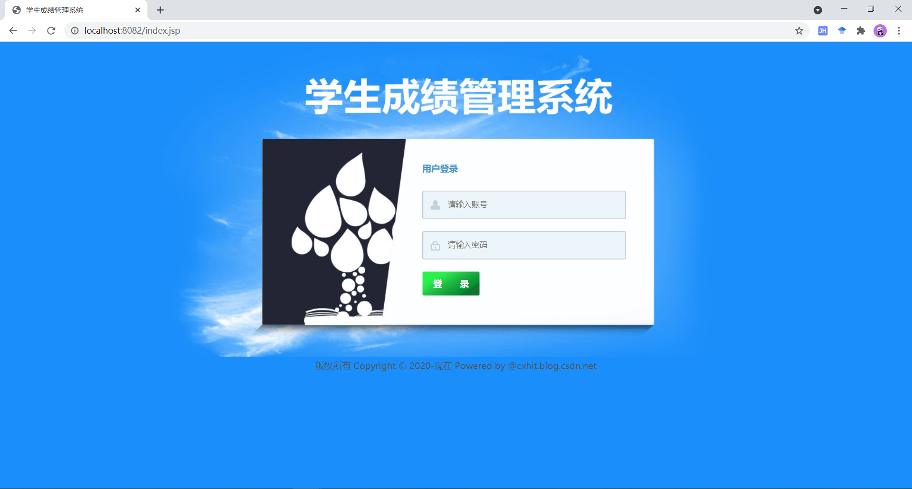

**后台主页：**

>   如果直接访问后台主页，拦截器进行拦截，并返回登录页。

**学生管理之学生列表页：**

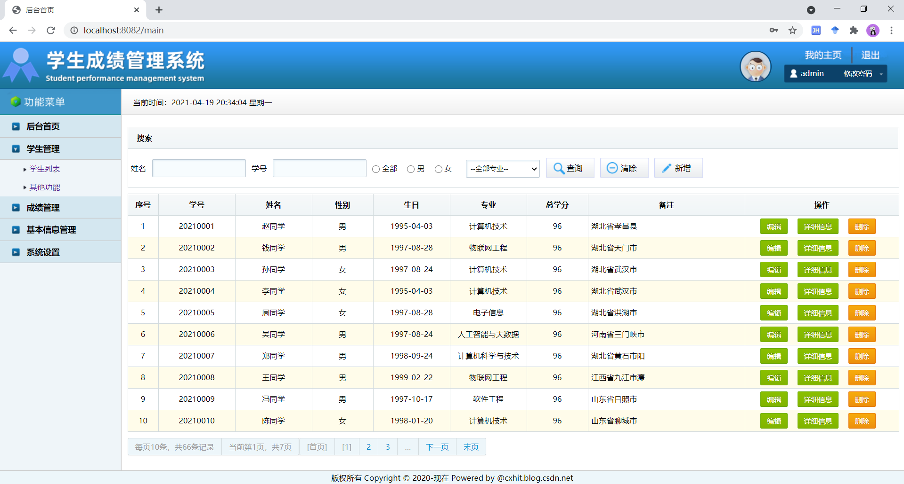

>   主要是分页显示数据。

**学生模糊查询页面**

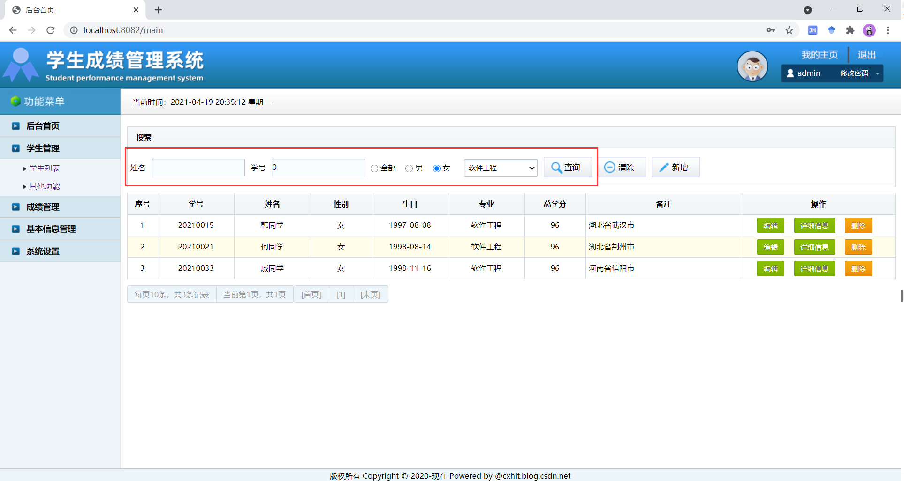

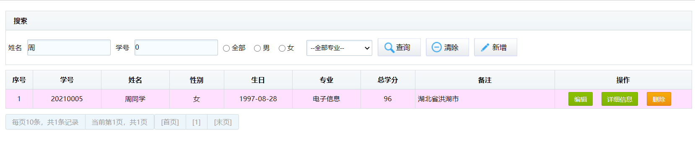

**新增学生页面：**

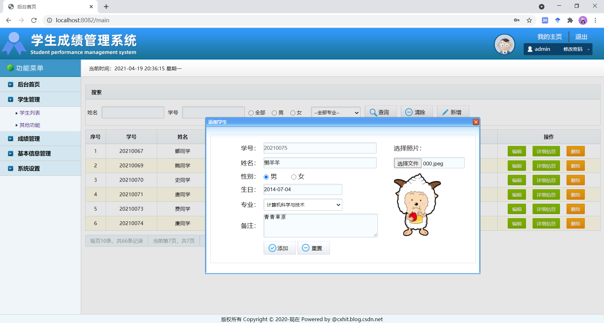

>   其中学号是不可编辑的，由系统生成！

**添加成功后：**

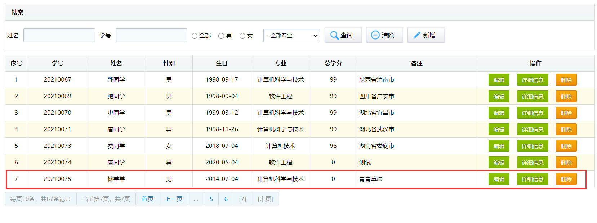

>   添加成功后，提示“添加成功”，并且页面自动刷新加载新数据

**查看学生详细信息页：**

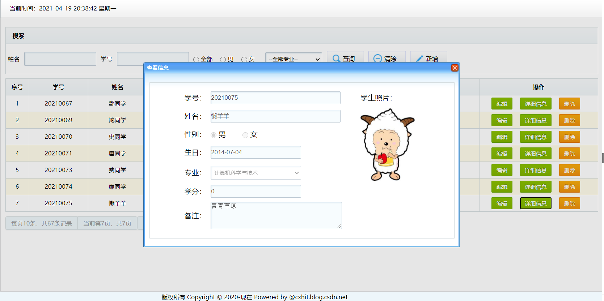

>   只能查看，不可编辑（主要是查看照片）

**编辑学生信息页：**

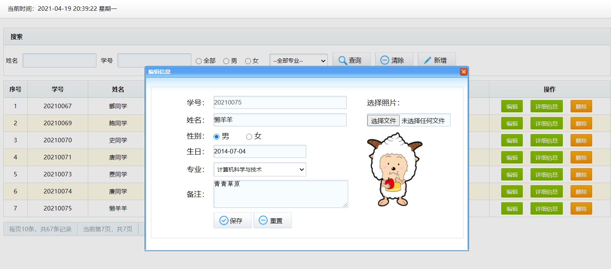

>   加载原始信息（包括照片），修改后，所有信息替换成新的。学号不可编辑。

**删除学生提示页：**

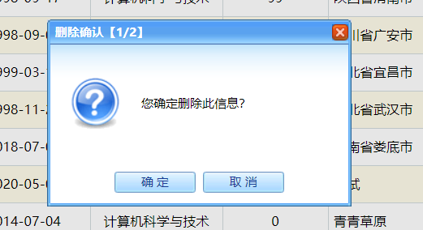

>   需要两步确认

**学生成绩管理页：**

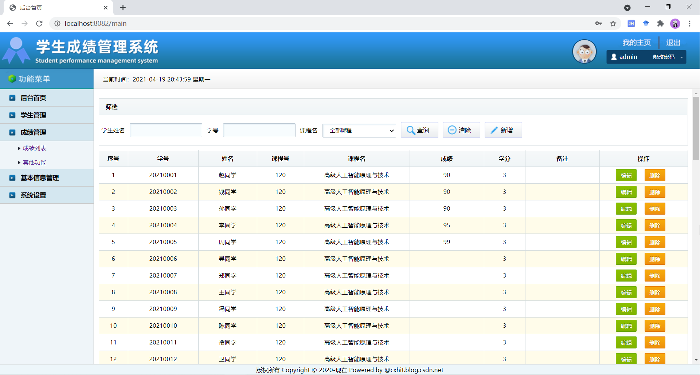

>   这里懒得写分页了，逻辑和学生列表一致。

**筛选查询：**

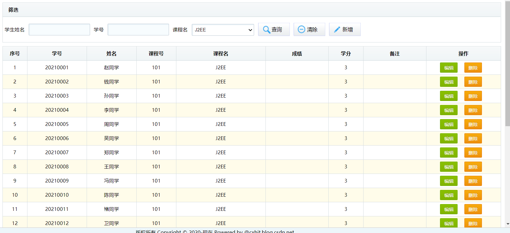

**编辑成绩：**

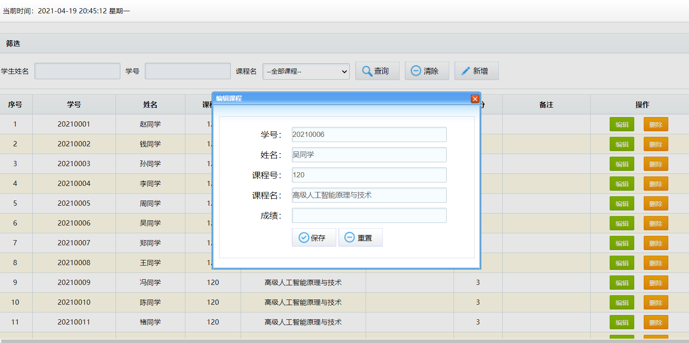

>   关于成绩管理模块，上图中的“新增”和“删除”功能未实现，如有需要可扩充。

**课程管理：**

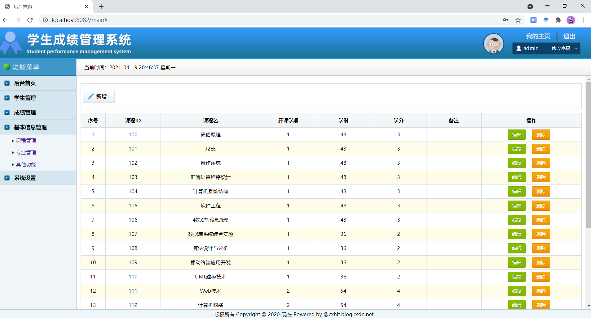

>   上图"新增"、“编辑”、“删除”功能未写。

**专业管理：**

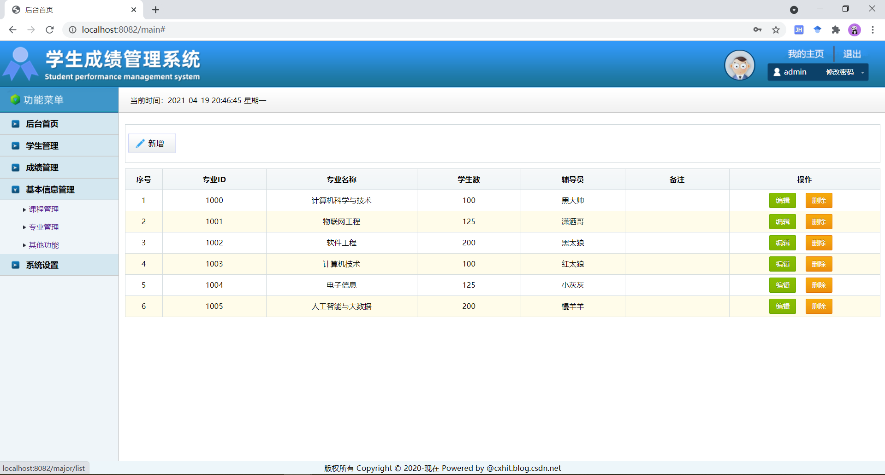

>   上图"新增"、“编辑”、“删除”功能未写。

### 参考资料

1.  后台SSH框架基于：https://github.com/sysuKinthon/SSHLearning_pure_version

2.  前端模板来自：https://www.oneyuanma.com/code/27d4ceb7bc7c4741a9247b69143bc9bd.html
